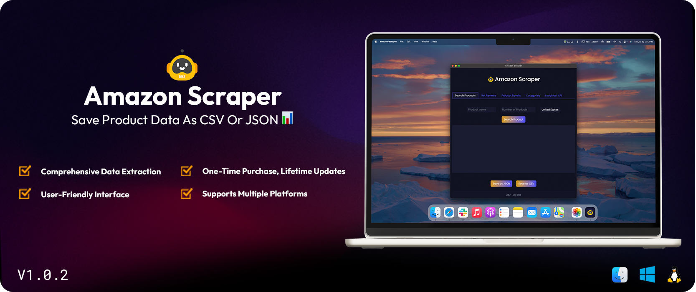

# Amazon Scraper Software

Unlock the power of dropshipping with our advanced Amazon Scraper Software. This tool is designed to help you effortlessly search, scrape, and save product data from Amazon, making your dropshipping business more efficient and profitable.

## Key Features

- **Search Product**: Quickly find products on Amazon using our robust search functionality.
- **Scrape Reviews**: Gather comprehensive reviews for any product, giving you valuable insights into customer opinions.
- **Get Product Details**: Access detailed information about products, including titles, descriptions, features, and more.
- **Get Categories**: Retrieve a list of categories to organize your products better.
- **Localhost API**: Easily integrate with your existing systems using our localhost API.
- **Save Data as CSV or JSON**: Export scraped data in your preferred format for further analysis and use.

## How It Works

1. **Search Products**: Enter your search query to find products on Amazon.
2. **Scrape Data**: Select products and scrape detailed information and reviews.
3. **Save Data**: Export the data as CSV or JSON files to your local machine.

## Purchase the Software

To purchase the Amazon Scraper Software, visit our [shop](https://shop.dakidarts.com/product/unlock-the-power-of-dropshipping-with-our-amazon-scraper-software/). After purchase, you'll be able to download the software according to your operating system.

## Installation

Once you've purchased and downloaded the software, follow the instructions provided in the download package to install it on your system.

## FAQs

### What is the Amazon Scraper Software?
Our software is a powerful tool designed to help dropshippers scrape and save product data from Amazon, making it easier to find profitable products and gather valuable customer feedback.

### How do I install the software?
After purchasing the software from our [shop](https://shop.dakidarts.com/product/unlock-the-power-of-dropshipping-with-our-amazon-scraper-software/), download the installation package and follow the instructions provided.

### What data formats does the software support for exporting?
You can export the scraped data as CSV or JSON files.

### Can I integrate this software with my existing systems?
Yes, our software includes a localhost API for easy integration with your existing systems.

### How do I purchase the software?
You can purchase the Amazon Scraper Software from our [shop](https://shop.dakidarts.com/product/unlock-the-power-of-dropshipping-with-our-amazon-scraper-software/).

### Who can I contact for support?
For support, please visit our [contact page](https://shop.dakidarts.com/contact) on the shop website.

## Contributing

We welcome contributions! Please fork the repository and submit a pull request with your improvements.

## License

This project is licensed under the [MIT License](https://github.com/dakidarts/amazon-scraper-software?tab=MIT-1-ov-file).

## Connect with Us

- [Shop](https://shop.dakidarts.com)
- [GitHub](https://github.com/dakidarts)

---

Enhance your dropshipping business with our Amazon Scraper Software. [Purchase now](https://shop.dakidarts.com/product/unlock-the-power-of-dropshipping-with-our-amazon-scraper-software/)!
